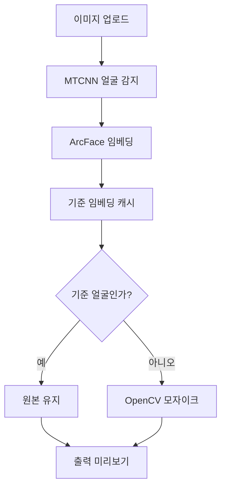

# 얼굴 인식 기반 선택적 모자이크 시스템

## 프로젝트 목적
단체 사진 또는 영상에서 "기준 인물" 한 명을 제외한 모든 얼굴을 자동으로 감지하고 모자이크 처리하는 시스템을 구현합니다. ArcFace 기반 임베딩과 LFW 데이터셋을 활용해 기준 인물을 정확하게 식별하고, OpenCV로 나머지 얼굴을 픽셀화하여 개인정보 보호를 지원합니다.

## 아키텍처 개요
1. **FaceDetector (MTCNN)** – 이미지를 불러와 얼굴 위치를 찾습니다.
2. **FaceEmbedder (ArcFace)** – 각 얼굴을 512차원 벡터로 변환합니다.
3. **ReferenceManager/ReferenceMatcher** – 기준 인물 임베딩을 캐시한 뒤, 새로운 얼굴 벡터와 비교(L2/Cosine)해 동일 인물 여부를 판단합니다.
4. **MosaicProcessor** – 기준 인물을 제외한 얼굴 영역에 모자이크를 적용합니다.

```
입력 이미지 → 얼굴 감지 → 임베딩 추출 → 기준 얼굴 매칭 → 비기준 얼굴 모자이크
```

## 데이터셋 및 준비
- **LFW (Labeled Faces in the Wild)**: 공개 얼굴 인식 데이터셋입니다. https://datasets.activeloop.ai/docs/ml/datasets/lfw-dataset/
- `data/lfw/` 경로 아래에 이미지를 다운로드 후 배치합니다.
- 추후 실제 사용자 이미지를 사용할 경우, 개인정보 보호 정책을 준수합니다.

## 인터페이스 시각화

- 1단계: 로컬 CLI/스크립트에서 이미지와 기준 인물 이미지를 선택합니다.
- 2단계: 추후 웹 UI를 추가하여 업로드, 미리보기, 결과 다운로드까지 한 화면에서 수행할 계획입니다.

## 실행 방법 (로컬)
1. 의존성 설치
   ```bash
   python -m venv .venv && source .venv/bin/activate
   pip install -r requirements.txt
   ```
2. 구성 파일 편집: `config/default.yaml`에서 모델 경로, 임계값 등을 설정합니다.
3. 샘플 실행 (추후 runner/API 연결 예정)
   ```bash
   python main.py --input data/samples/group.jpg --reference data/samples/reference.jpg
   ```

## 테스트
pytest 기반 기본 단위 테스트를 제공합니다.
```bash
pytest
```
- 이미지 로드/저장, 기준 매칭, 모자이크 적용 등의 최소 동작을 검증합니다.

## 로드맵
- ✅ 이미지 처리 파이프라인 스켈레톤
- ⏳ 실시간 웹캠 처리 모듈 (`streaming/`) 연결
- ⏳ FastAPI 기반 서버 및 간단한 웹 UI 제공
- ⏳ GPU 추론 최적화 및 대용량 배치 처리

## 기여 방법
1. 새로운 기능/버그는 이슈 작성 후 작업합니다.
2. PR에는 테스트 결과를 포함하고, 코드 스타일(타입 힌트/도큐스트링)을 유지해주세요.
3. 문서나 UI 변경 시 스크린샷 또는 다이어그램을 함께 첨부하면 좋습니다.
