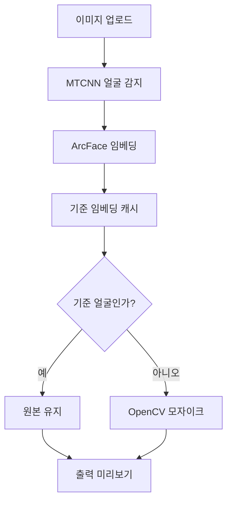

# Face Embedding & Selective Mosaic Pipeline

## 1. 개요
ArcFace 임베딩 + MTCNN 얼굴 검출을 사용해 기준 인물은 유지하고 다른 얼굴은 모자이크 처리하는 파이프라인입니다.

구성요소:
- 검출: MTCNN (facenet-pytorch)
- 임베딩: ArcFace ONNXRuntime (`models/arcface.onnx`)
- 매칭: 코사인 거리 기반 임계값 (`config/pipeline.yaml`의 `mosaic_threshold`)
- 후처리: 모자이크 픽셀화

## 아키텍처 개요
1. **FaceDetector (MTCNN)** – 이미지를 불러와 얼굴 위치를 찾습니다.
2. **FaceEmbedder (ArcFace)** – 각 얼굴을 512차원 벡터로 변환합니다.
3. **ReferenceManager/ReferenceMatcher** – 기준 인물 임베딩을 캐시한 뒤, 새로운 얼굴 벡터와 비교(L2/Cosine)해 동일 인물 여부를 판단합니다.
4. **MosaicProcessor** – 기준 인물을 제외한 얼굴 영역에 모자이크를 적용합니다.

## 핵심 알고리즘 스택

1. **얼굴 감지 – MTCNN**  
   - CNN 기반으로 얼굴 위치와 눈·코 랜드마크를 정밀 탐지.
2. **얼굴 임베딩 추출 – ArcFace**  
   - Angular Margin Loss를 사용하는 최신 모델로, 다양한 얼굴 각도에 강인하다.
   - FaceNet 대비 정확도가 높아 추천.
3. **얼굴 비교 – L2 Distance**  
   - 각 얼굴 임베딩과 기준 인물 임베딩 간 L2(유클리드) 거리 계산.
   - Threshold를 설정해 기준 인물만 구별.
4. **모자이크 처리 – OpenCV**  
   - 얼굴 영역에 픽셀 블러 또는 가우시안 블러 적용.
   - 기준 인물은 제외하고 나머지 얼굴만 모자이크 처리.
   - 
```
입력 이미지 → 얼굴 감지 → 임베딩 추출 → 기준 얼굴 매칭 → 비기준 얼굴 모자이크
```

## 2. 환경 (conda 표준)
팀(OS: macOS + Windows) 혼합 환경 → conda 사용.

### 환경 생성
```bash
conda env create -f environment.yml
conda activate face-embed
python -m pip install --upgrade pip
```

Apple Silicon(M1/M2)에서 `onnxruntime` 문제가 있으면:
```bash
pip install onnxruntime-silicon
```

### 설치 확인
```bash
python -c "import cv2, onnxruntime, torch; print('cv2', cv2.__version__, 'onnxruntime', onnxruntime.__version__, 'torch', torch.__version__)"
python -c "import facenet_pytorch; print('facenet-pytorch OK')"
```

## 3. 기본 실행 흐름
1. `config/pipeline.yaml`에서 `reference_image`(기준 인물)와 `test_image`(처리 대상) 경로 설정.
2. 기준 인물 얼굴 임베딩 계산 및 캐시.
3. 대상 이미지에서 얼굴 검출 → 각 얼굴 임베딩 추출 → 기준과 코사인 거리 비교.
4. 기준과 다른 얼굴만 모자이크 후 `data/output`에 저장.

## 4. 디렉터리 구조
```
components/
	detection/        # MTCNN 감지 (현재 스텁 상태)
	embedding/        # ArcFace 임베더 (스텁)
	matching/         # 코사인 거리 매칭
	processing/       # 모자이크 처리
	reference/        # 기준 얼굴 임베딩 캐시
config/             # YAML 설정
models/             # onnx 모델 파일들
data/input          # 입력 / 기준 / 테스트 이미지
data/output         # 결과 저장
```

<<<<<<< HEAD
## 5. 인터페이스 시각화

- 1단계: 로컬 CLI/스크립트에서 이미지와 기준 인물 이미지를 선택합니다.
- 2단계: 추후 웹 UI를 추가하여 업로드, 미리보기, 결과 다운로드까지 한 화면에서 수행할 계획입니다.

=======
## 5. 할 일 (로직 구현 예정)
- [ ] MTCNN 실제 검출 코드 연결 (facenet-pytorch 이용)
- [ ] ArcFace 임베더 전처리/추론/L2 정규화 구현
- [ ] ReferenceManager에서 검출 결과 중 가장 큰 얼굴 선택 후 임베딩
- [ ] 간단 CLI (`python -m runner.image_runner`) 추가
- [ ] LFW 샘플 자동 다운로드 스크립트 추가
>>>>>>> b582edb (초기 환경 세팅: conda 환경 설정, OpenCV/MTCNN/ArcFace 설치, 테스트 이미지 준비)

## 6. 문제 해결 팁
| 문제 | 원인 | 해결 |
|------|------|------|
| onnxruntime ImportError | Apple Silicon 미지원 바이너리 | `pip install onnxruntime-silicon` |
| facenet-pytorch GPU 미동작 | CUDA 없는 환경 | CPU 기본 모드 사용, 추가 설정 불필요 |
| 얼굴 검출 없음 | 모델 미로딩/전처리 오류 | RGB 변환 확인(BGR→RGB), 이미지 경로 재확인 |

## 7. 참고 명령 모음
```bash
# 환경 제거
conda remove -n face-embed --all -y
# 패키지 목록 내보내기
conda env export -n face-embed > lock.yml
```

## 8. 라이선스
원본 라이선스 파일(`LICENSE`) 참고.
<<<<<<< HEAD


=======
>>>>>>> b582edb (초기 환경 세팅: conda 환경 설정, OpenCV/MTCNN/ArcFace 설치, 테스트 이미지 준비)
